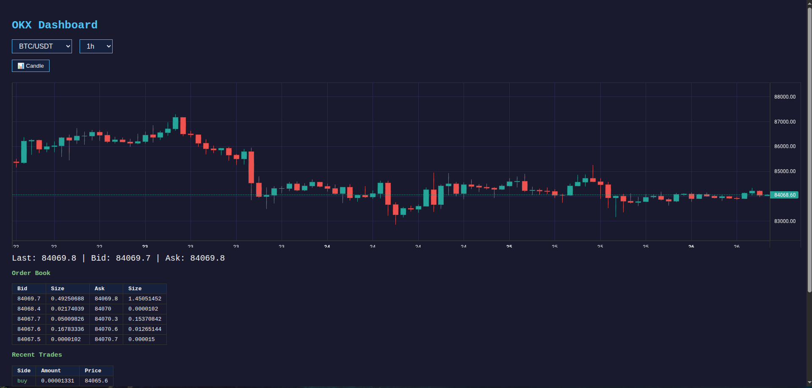

# OKX Trading Dashboard
   

A custom crypto trading terminal built with Flask + CCXT + TradingView Lightweight Charts.

## Features
- Live candlestick/line chart with toggle
- Auto-refreshing order book and trades (3s)
- Multi-symbol support (BTC, ETH, SOL, XRP, DOGE)
- Multiple timeframes (1m to 1d)

## Setup

1. Install Python 3.12
2. Create virtual environment:

python3 -m venv venv
source venv/bin/activate

3. Install dependencies:

pip install -r requirements.txt

4. Create your config file:

cp .env.example .env

5. Edit `.env` and replace the placeholders with your OKX API credentials.
6. Run:

python3 app.py

7. Open http://localhost:8501

## Files

| File | Purpose |
|------|---------|
| `app.py` | Backend (Flask + CCXT) |
| `js.js` | Frontend (chart, tables, auto-refresh) |
| `.env` | Your API keys (never share this) |
| `.env.example` | Template for `.env` |
| `requirements.txt` | Python dependencies |

## Notes
- API key needs at minimum "Read" permission on OKX.
- Trade permission requires $100+ account balance on OKX.
- Default port is 8501. Change it in `app.py` if needed.

Save (Ctrl+S).
